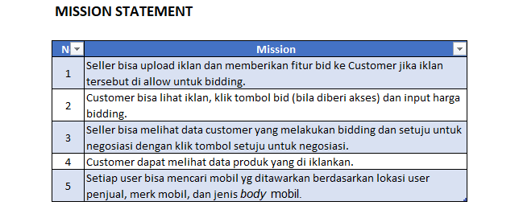
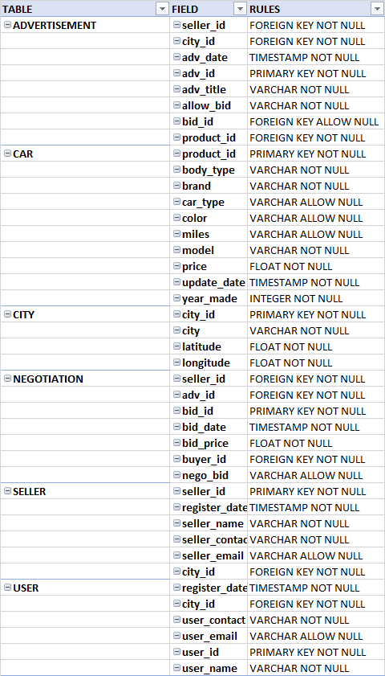
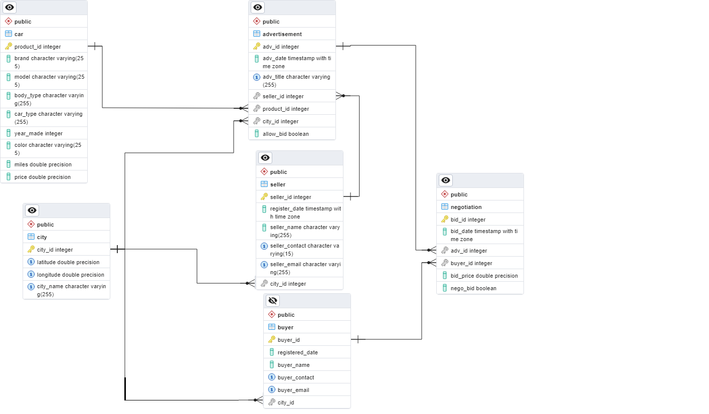

# Secondary Car Marketplace
# About and Overview
Sebuah bisnis marketplace ingin membuat sistem manajemen data yang rapih dan efisien. Mereka ingin data tersimpan dalam sebuah kategori dan secara intuitif mudah dipahami. Selain itu data akan di inject secara realtime tergantung pada aktivitas dan traffic user dalam web. Pada projek ini, saya menerapkan prinsip RDBMS untuk perancangan database yang dapat memecahkan masalah diatas.

# Summary
* Mission Statement
* Business Rules
* Design Requirements
* ERD diagram

# Database Purpose:

# Business Rules:

# Design Requirements:

* Definisikan hubungan Parent dan Child Table menggunakan Primary Key dan Foreign Key.
* Data set disiapkan dengan program python dan siap langsung digunakan.
* Buat views yang berisi query transaksi yang akan sering digunakan user, dan query analytics yang akan membantu analisa bisnis sehari-hari.

# ER Diagram:

